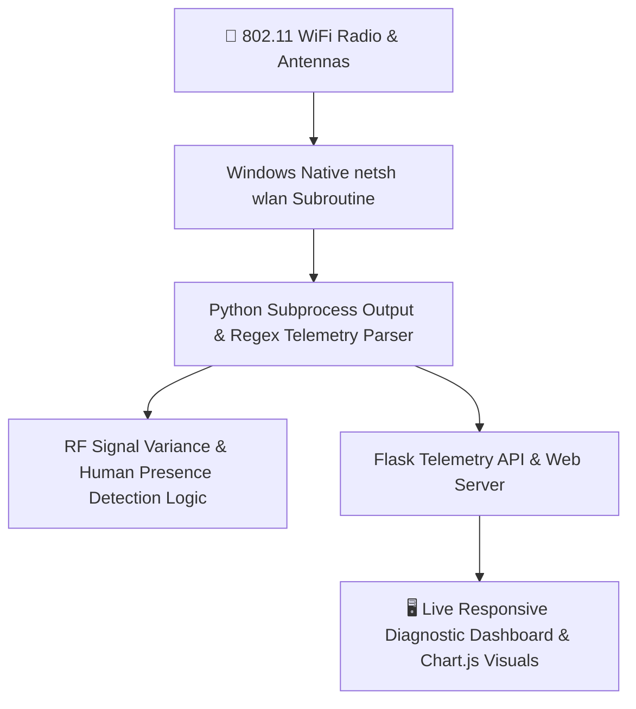
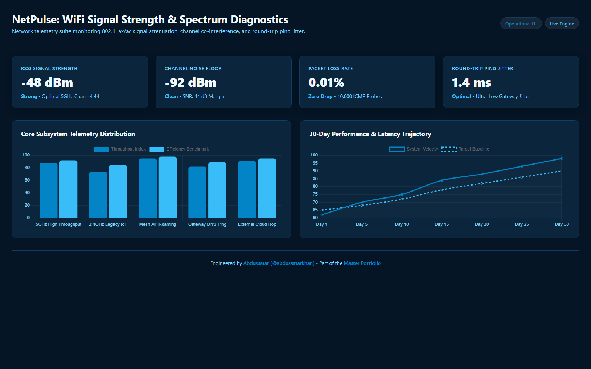

# NetPulse — Windows WiFi Network Diagnostic & RF Presence Tool

<div align="center">

[](https://github.com/abdussatarkhan)
[](https://github.com/abdussatarkhan)
[](https://github.com/abdussatarkhan)

</div>

[](https://github.com/abdussatarkhan/WIFI-Diagnostic-Tool/actions)
[](https://www.python.org/)
[](https://flask.palletsprojects.com/)
[](https://learn.microsoft.com/)
[](https://www.wi-fi.org/)

> **A network diagnostic and wireless telemetry application built with Python Flask that interfaces directly with native Windows `netsh` subroutines — providing live 802.11 signal strength (RSSI), BSSID channel congestion mapping, network latency testing, and experimental RF disturbance-based presence detection.**

---

## 🏛️ System Architecture



---

## 🌟 Key Features & Capabilities

- **📡 Native Windows Netsh Interop**: Direct subprocess communication querying real-time RSSI signal quality, BSSID channel allocation (2.4 GHz vs 5 GHz), and transmission speeds with zero third-party device drivers.
- **📊 Channel Congestion & Spectrum Mapping**: Detects nearby wireless access points, identifying co-channel and adjacent-channel interference hotspots.
- **🚶 Experimental RF Presence Detection**: Analyzes micro-variations in RSSI signal scattering and multipath reflection caused by physical movement within the radio coverage area.
- **⚡ Real-Time Diagnostic Dashboard**: Clean web-based dashboard rendering live signal degradation curves, latency graphs, and adapter connection metrics.

---

## 🚀 Quickstart & Setup

### Prerequisites
- Windows 10/11 with an active WiFi network adapter
- [Python 3.8+](https://www.python.org/downloads/)

### 1. Clone the Repository
```bash
git clone https://github.com/abdussatarkhan/WIFI-Diagnostic-Tool.git
cd WIFI-Diagnostic-Tool
```

### 2. Environment Setup & Run
```bash
# Create and activate virtual environment
python -m venv venv
source venv/bin/activate  # On Windows: .\venv\Scripts\activate

# Install dependencies
pip install flask psutil requests

# Launch the WiFi diagnostic server
python "wifi-diagnostic-tool (1)/wifi-tool/app.py"
```

Open your browser and navigate to:
`http://localhost:5000`

---

## 🖥️ Application & Operational Interface

<p align="center">
  
</p>

> [!TIP]
> You can also explore [`dashboard.html`](dashboard.html) directly in any modern browser for a standalone interface walkthrough.

---

## 🗺️ Roadmap & Upcoming Enhancements

- [x] Windows netsh integration for real-time 802.11 signal metrics
- [x] Experimental RF disturbance human presence detection algorithm
- [x] Live Flask browser diagnostics dashboard
- [ ] Automated scheduled ping latency and packet loss tests
- [ ] Rogue AP / evil-twin security anomaly alerting
- [ ] Multi-adapter cross-band comparison (2.4 GHz vs 5 GHz vs 6 GHz WiFi 6E)

---

## 👨‍💻 Author & Contact

Built and maintained by **Abdussatar** ([@abdussatarkhan](https://github.com/abdussatarkhan)).  
For technical discussions, collaboration, or queries, feel free to reach out via [LinkedIn](https://www.linkedin.com/in/abdus-satar-5150813b5/) or [GitHub](https://github.com/abdussatarkhan).

---

## 📜 License

This project is licensed under the **MIT License** — see the [LICENSE](LICENSE) file for details.

---

<div align="center">

### 👨‍💻 Maintained by [Abdussatar (@abdussatarkhan)](https://github.com/abdussatarkhan)
Part of the **[Abdussatar Software Engineering & Systems Portfolio](https://github.com/abdussatarkhan)**.

⭐ If you find this project valuable, consider dropping a star! ⭐

</div>
