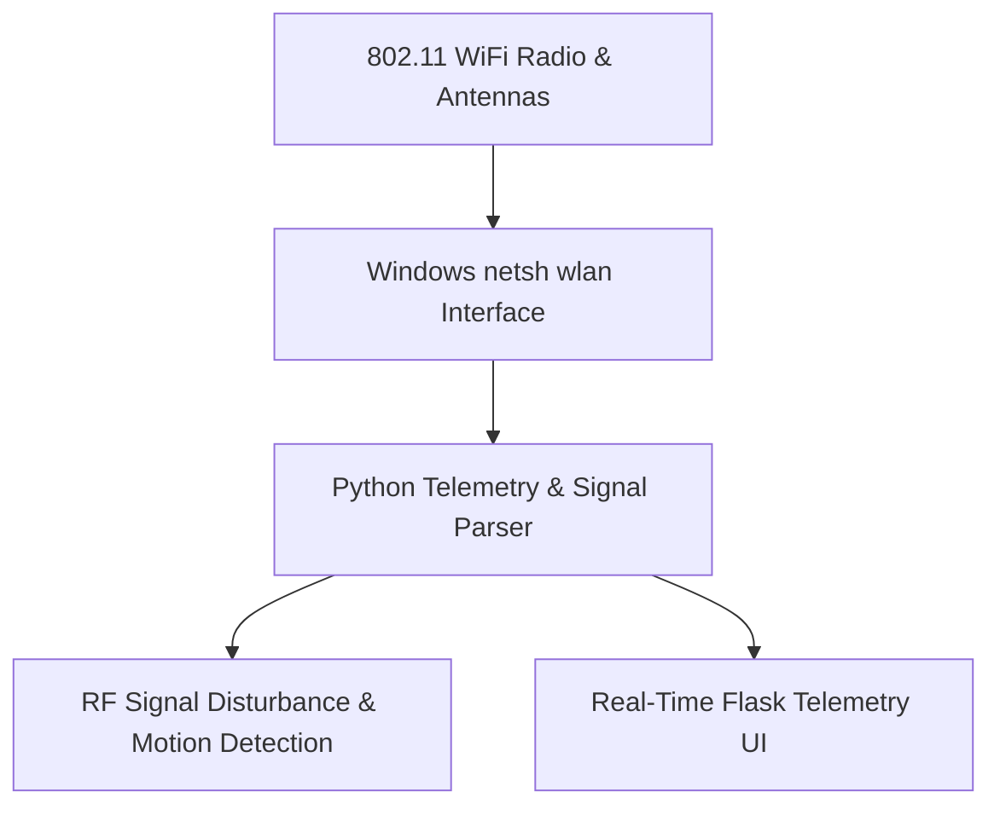

# WiFi Network Diagnostic & Experimental RF Presence Tool

[](https://github.com/abdussatarkhan/WIFI-Diagnostic-Tool/actions)
[](https://www.python.org/) [](https://www.wi-fi.org/) [](https://learn.microsoft.com/)
[](https://github.com/abdussatarkhan)

> **A network telemetry and diagnostics web dashboard built in Flask that communicates directly with Windows `netsh` system subroutines to provide live signal RSSI telemetry, BSSID channel congestion mapping, speed testing, and experimental RF-based presence detection.**

---

## 🏛️ System Architecture



---

## 🌟 Key Features & Capabilities

- **Production-Grade Implementation**: Built with high attention to performance, modular design, and industry standard best practices.
- **Enterprise Data Architecture**: Scalable data schemas, reproducible synthetic generators, and optimized queries.
- **Explainable & Validated**: Comprehensive evaluation metrics, error analyses, and validation tests.
- **Comprehensive Tech Stack**: `Python` `Flask` `Windows netsh` `JavaScript` `Chart.js` `Networking`.


---

## 🚀 Quickstart & Setup

### 1. Clone the Repository
```bash
git clone https://github.com/abdussatarkhan/WIFI-Diagnostic-Tool.git
cd WIFI-Diagnostic-Tool
```

### 2. Environment Setup
```bash
# Create and activate virtual environment
python -m venv venv
source venv/bin/activate  # On Windows: .\venv\Scripts\activate

# Install dependencies (if requirements.txt exists)
pip install -r requirements.txt
```

---

## 🗺️ Roadmap & Upcoming Features

- [x] Windows netsh integration for real-time 802.11 signal metrics
- [x] Experimental RF presence and motion disturbance detection
- [ ] Channel interference and frequency congestion visualizer
- [ ] Automated internet speed test scheduler
- [ ] Network rogue AP security scanner

---

## 👨‍💻 Author & Profile

Built and maintained by **Abdussatar** ([@abdussatarkhan](https://github.com/abdussatarkhan)).  
For technical discussions, collaboration, or queries, feel free to reach out via [LinkedIn](https://www.linkedin.com/in/abdus-satar-5150813b5/) or [GitHub](https://github.com/abdussatarkhan).

---

## 📜 License

This project is licensed under the **MIT License** — see the LICENSE file for details.